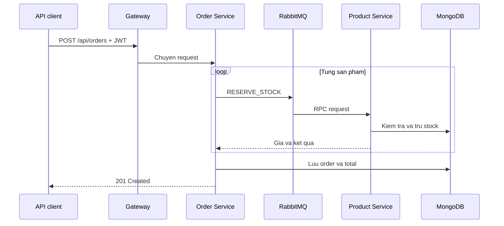

# Phan tich chuc nang ung dung DACN

## 1. Pham vi va phuong phap

Tai lieu nay duoc lap tu ma nguon dang co trong repository `DACN`, bao gom frontend, API Gateway, ba backend service, Docker Compose, Helm chart va cau hinh staging trong repository `DACN-GITOPS`.

Phan tich chi ghi nhan chuc nang da co trong ma nguon. Cac muc du kien trong README nhung chua co route, service hoac giao dien tuong ung khong duoc xem la chuc nang da hoan thanh. `k8s-automation` khong nam trong pham vi do an va khong duoc dung lam bang chung chuc nang.

## 2. Ket luan tong quan

He thong hien tai la mot ung dung thuong mai dien tu dang microservice, tap trung vao bon nang luc backend:

1. Xac thuc nguoi dung bang access token va refresh token.
2. Quan ly, tim kiem va doc danh muc san pham.
3. Tao, truy van va huy don hang.
4. Giu va hoan ton kho giua Order Service va Product Service.

Backend da co mot luong nghiep vu lien service co y nghia. Tuy nhien, frontend chi ho tro dang nhap va hien thi trang bao da dang nhap. Cac thao tac xem san pham, quan ly san pham, tao don, xem don va huy don moi chi co o cap API. Vi vay, pham vi dung nhat cua san pham hien tai la **he thong backend thuong mai dien tu co giao dien dang nhap toi thieu**, khong phai mot website thuong mai dien tu hoan chinh cho nguoi dung cuoi.

## 3. Kien truc chuc nang

| Thanh phan | Trach nhiem dang co | Phu thuoc chinh |
| --- | --- | --- |
| Frontend | Dang nhap, luu access token, bao ve route `/`, thu lam moi token khi gap 401 | Gateway/Auth API |
| API Gateway | Diem vao `/api`, kiem tra JWT, gioi han tan suat, dinh tuyen request, tong hop health | Auth, Product, Order |
| Auth Service | Dang ky, dang nhap, cap va xoay token, dang xuat, seed tai khoan | MongoDB, Redis |
| Product Service | Liet ke, loc, phan trang, CRUD san pham, cache, giu/hoan ton kho | MongoDB, Redis, RabbitMQ |
| Order Service | Liet ke, tao, doc, huy don, phoi hop ton kho va rollback | MongoDB, Redis, RabbitMQ |
| MongoDB | Luu nguoi dung, san pham, chi tiet san pham va don hang | Cac backend service |
| Redis | Luu refresh token, cache ket qua va distributed lock | Auth, Product, Order |
| RabbitMQ | RPC bat dong bo theo request/reply cho nghiep vu ton kho | Product, Order |
| FluxCD va Helm | Trien khai, dong bo desired state, probe, resource va HPA | Kubernetes, GitOps repo |
| Observability | Metrics ha tang, trace OpenTelemetry, log backend/UI | Prometheus/Grafana, Jaeger, Elasticsearch/Kibana |

## 4. Frontend

### 4.1 Chuc nang da co

- Route `/login` hien form email va password.
- Gui `POST /api/auth/login` thong qua Axios.
- Luu access token trong Redux va `redux-persist`.
- Gan `Authorization: Bearer <token>` vao cac request sau dang nhap.
- Khi API tra 401, frontend goi `/api/auth/refresh`, cap nhat access token va thu lai request cu.
- Route `/` duoc bao ve; khong co token thi chuyen ve `/login`.

### 4.2 Chuc nang chua co tren giao dien

- Dang ky tai khoan.
- Thong bao loi dang nhap cho nguoi dung.
- Dang xuat.
- Danh sach, tim kiem, loc va chi tiet san pham.
- Gio hang.
- Tao, xem va huy don hang.
- Quan tri danh muc san pham.
- Trang 404 va fallback cho route frontend.

Image frontend dung cau hinh Nginx mac dinh, khong co `try_files ... /index.html`. Do do truy cap truc tiep `/login` co the tra 404 du route nay ton tai trong React Router. Kiem thu chi goi `/` se khong phat hien loi nay.

## 5. Auth Service

### 5.1 API

| Method | Duong dan service | Duong dan qua gateway | Hanh vi |
| --- | --- | --- | --- |
| POST | `/register` | `/api/auth/register` | Tao nguoi dung va bam mat khau |
| POST | `/login` | `/api/auth/login` | Xac thuc, tra access token, dat refresh-token cookie |
| POST | `/refresh` | `/api/auth/refresh` | Xac minh va xoay access/refresh token |
| POST | `/logout` | `/api/auth/logout` | Xoa refresh token trong Redis va cookie |
| GET | `/health` | `/api/auth/health` | Kiem tra MongoDB va Redis |

### 5.2 Quy tac nghiep vu

- Email la duy nhat trong collection `userAuth`.
- Mat khau duoc bam bang bcrypt.
- Access token va refresh token dung hai secret khac nhau.
- Redis luu mot refresh token tai key `rf_token:<userId>`.
- Refresh token duoc xoay sau moi lan refresh.
- Dung lai token cu se bi tu choi va xoa token hien tai cua nguoi dung.
- Dang nhap moi tren cung tai khoan ghi de refresh token cu. Vi vay mo hinh hien tai ve thuc chat chi duy tri mot phien refresh hop le cho moi tai khoan.

### 5.3 Gioi han

- Khong co validate email, do dai mat khau hay schema request ro rang.
- Khong co API doc profile, doi mat khau, quen mat khau hoac xoa tai khoan.
- `auth.middleware.js` goi ham `verifyToken` nhung `jwt.js` khong export ham nay. Middleware hien khong duoc gan vao route nen loi dang ngu, nhung se hong neu duoc su dung sau nay.
- File seed tao tai khoan co dinh va integration test tao them user nhung khong don dep user sau test.

## 6. Product Service

### 6.1 API

| Method | Duong dan | Chuc nang |
| --- | --- | --- |
| GET | `/` | Liet ke, loc va phan trang san pham |
| GET | `/:id` | Lay san pham va noi them description |
| POST | `/` | Tao san pham |
| PATCH | `/:id` | Cap nhat san pham |
| DELETE | `/:id` | Xoa san pham |
| GET | `/health` | Kiem tra MongoDB va Redis |

Qua gateway, cac route chinh co prefix `/api/products`.

### 6.2 Tim kiem va du lieu

- Ho tro `category`, `name`, `minPrice`, `maxPrice`, `page`, `limit`.
- Product gom ID, ten, gia, anh, link, nhom danh muc va ton kho.
- Description nam o collection rieng `detail` va duoc ghep khi xem chi tiet.
- Co index cho ten, gia va category.

### 6.3 Cache va dong thoi

- Danh sach san pham duoc cache 60 den 79 giay.
- Chi tiet san pham duoc cache 120 den 149 giay.
- Khi cache miss, service dat Redis lock de han che cache stampede.
- Tao, sua, xoa va thay doi ton kho se xoa cache lien quan.
- RabbitMQ consumer nhan `RESERVE_STOCK` va `RELEASE_STOCK` tu Order Service.
- Distributed lock theo product ID ngan hai request sua ton kho cung luc trong mot khoang ngan.

### 6.4 Gioi han

- Tao ID moi bang cach doc san pham cuoi va cong mot. Hai request tao dong thoi co the sinh trung ID.
- API CRUD khong co role authorization. Bat ky tai khoan da dang nhap qua gateway deu co the tao, sua hoac xoa san pham.
- Du lieu dau vao nhu gia am, stock am, limit am hoac category sai kieu chua duoc validate day du.
- Cap nhat ID khong ton tai co the tra `200` voi body `null`; xoa ID khong ton tai van co the tra thong bao thanh cong.
- Khi cache lock dang bi giu, request chi doi 100 ms roi co the tra `Server busy`, chua co retry/backoff day du.

## 7. Order Service

### 7.1 API

| Method | Duong dan | Chuc nang |
| --- | --- | --- |
| GET | `/` | Liet ke don, loc theo orderID, userID hoac productID |
| GET | `/:id` | Lay chi tiet mot don |
| POST | `/` | Tao don va tru ton kho |
| DELETE | `/:id` | Huy don va hoan ton kho |
| GET | `/health` | Kiem tra MongoDB va Redis |

Qua gateway, cac route co prefix `/api/orders` va `/api/order`.

### 7.2 Luong tao don

- Order Service khong tin gia do client gui. Gia duoc lay tu Product Service khi giu ton kho.
- Neu mot san pham that bai, service gui `RELEASE_STOCK` cho cac san pham da giu truoc do.
- Khi huy don, service hoan stock tung san pham roi xoa order.
- Danh sach va chi tiet don duoc cache, sau do bi invalidation khi tao hoac huy.

### 7.3 Gioi han

- `userID` lay truc tiep tu body hoac query, khong lay tu JWT/header do gateway gan. Nguoi dung da dang nhap co the tao, xem hoac huy don bang userID cua nguoi khac.
- RPC RabbitMQ khong co timeout. Neu Product Service hoac reply queue khong tra loi, request tao/huy don co the cho vo han.
- Moi lan RPC tao mot exclusive reply queue va consumer; code khong chu dong cancel consumer sau khi nhan ket qua.
- Rollback la bu tru theo tung buoc, khong phai distributed transaction. Neu chinh thao tac RELEASE_STOCK that bai giua chung, du lieu co the khong nhat quan.
- Khong co trang thai don hang, thanh toan, giao hang, idempotency key hoac chong gui lap request tao don.
- Chua validate mang san pham rong, so luong am/0, dia chi rong va payload sai kieu mot cach nhat quan.

## 8. API Gateway

- Cho phep route goc, route auth va health bo qua JWT.
- Cac route nghiep vu con lai yeu cau Bearer token hop le.
- Gan `x-user-id` va `x-user-email` khi proxy, nhung backend hien chua dung cac header nay de phan quyen.
- Dinh tuyen auth, product va order theo prefix.
- Dung HTTP keep-alive agent va cho phep cau hinh socket pool.
- Rate limit theo IP trong bo nho cua tung gateway pod.
- Health tong hop Auth, Product va Order voi timeout 2 giay.

Rate limit hien khong chia se state giua cac pod. Khi HPA tao nhieu gateway pod, gioi han thuc te phu thuoc vao cach request duoc phan phoi. Day la gioi han kien truc, khong phai rate limiter tap trung.

## 9. Health, autoscaling va observability

- Helm chart tao liveness/readiness probe va resource request/limit cho tung service.
- Staging bat HPA cho Auth, Product, Order va Gateway.
- Gateway, Auth, Product va Order khoi tao OpenTelemetry tracing.
- Prometheus/Grafana thu metrics Kubernetes va container.
- OTel Collector nhan trace va co pipeline logs; trace duoc gui den Jaeger va Elasticsearch.
- Elasticsearch/Kibana cung cap noi luu tru va giao dien tim kiem.

Can phan biet viec thanh phan observability dang `Running` voi viec telemetry da du va dung. Trong repository hien khong thay DaemonSet nhu Fluent Bit/Filebeat hoac Node OTel log exporter de thu stdout container. Do do pipeline kiem thu can xac minh index log thuc su co document thay vi chi kiem tra Kibana/Collector dang chay.

Health route cua cac backend co mot diem can luu y: neu MongoDB o trang thai disconnected nhung `redis.ping()` van thanh cong, route van co the tra HTTP 200 kem `database: disconnected`. Client khong duoc chi dua vao status code.

## 10. Pham vi co the cong bo

Co the cong bo bang ma nguon hien tai:

- Ung dung duoc tach thanh microservice va trien khai qua Helm/FluxCD.
- Co xac thuc JWT va refresh-token rotation.
- Co CRUD san pham, cache va distributed lock.
- Co luong order-product qua RabbitMQ, tru ton kho va compensating rollback.
- Co probe, HPA va ba nhom cong cu quan sat metrics, logs, traces.

Khong nen cong bo qua muc:

- Frontend thuong mai dien tu hoan chinh.
- Phan quyen buyer/admin hoan chinh.
- Giao dich don hang exactly-once hoac dam bao nhat quan trong moi su co.
- Multi-session auth hoan chinh.
- Production-ready chi dua tren viec pod va cong cu observability dang chay.

